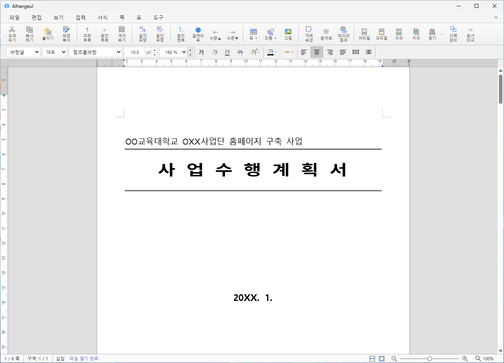
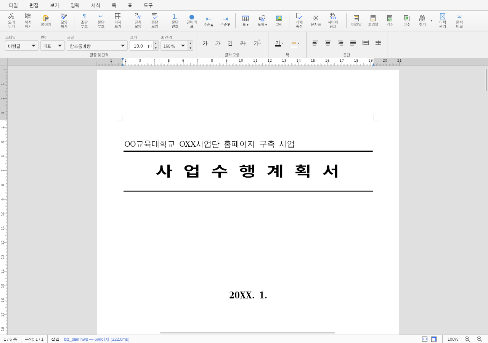
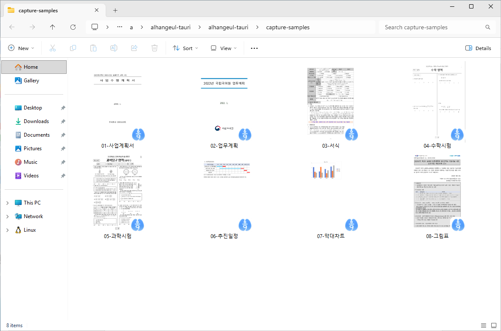
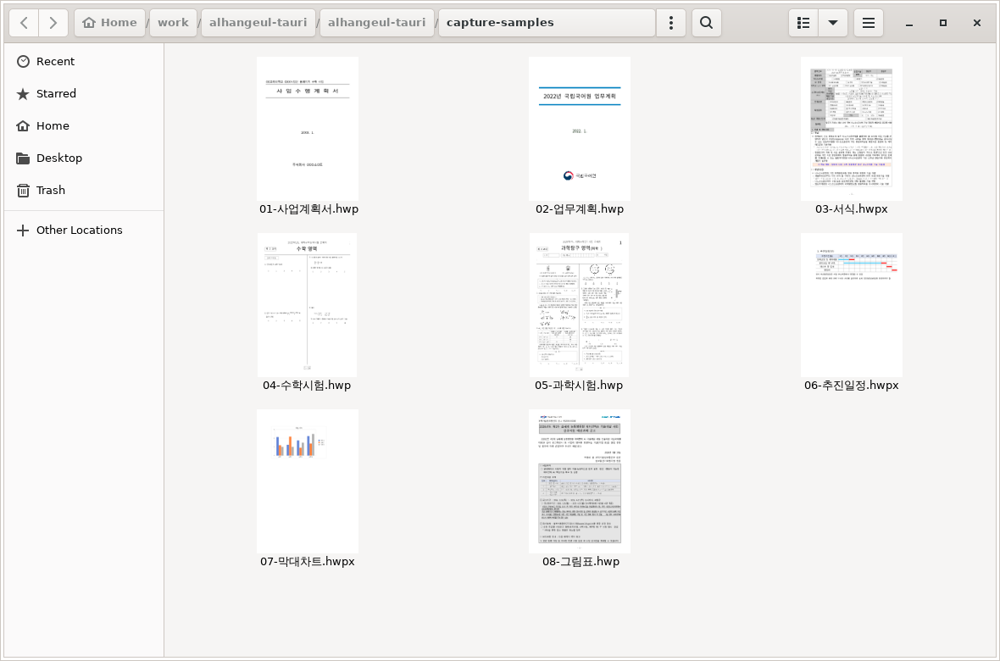

  

# 알한글 (Alhangeul)

**Windows와 Linux를 위한 오픈소스 HWP/HWPX 문서 편집기입니다.**
한글 문서를 열고, 편집하고, 저장하세요. 파일 탐색기에서도 문서의 첫 페이지를 미리 확인할 수 있습니다.

**[다운로드](https://postmelee.github.io/alhangeul-tauri/)** · [설치 안내·업데이트](https://postmelee.github.io/alhangeul-tauri/updates/) · [문의·제보](https://postmelee.github.io/alhangeul-tauri/feedback/)

현재 안정 버전: **[v0.1.0](https://github.com/postmelee/alhangeul-tauri/releases/tag/v0.1.0)**
무료로 사용할 수 있으며, 소스 코드는 [MIT 라이선스](LICENSE)로 공개합니다.

| Windows | Linux |
|---|---|
|  |  |

## 다운로드와 설치

[다운로드 페이지](https://postmelee.github.io/alhangeul-tauri/)에서 운영체제를 선택하세요.
모든 설치 파일과 체크섬은 [GitHub Release](https://github.com/postmelee/alhangeul-tauri/releases/latest)에서도 받을 수 있습니다.

| 운영체제 | 설치 형식 | 선택 안내 |
|---|---|---|
| Windows x64 | NSIS (`.exe`) | 일반 설치 권장 |
| Windows x64 | MSI (`.msi`) | 조직·관리 배포, NSIS 썸네일 문제 시 대안 |
| Linux x64 | AppImage | 실행 권한을 부여해 실행, 자동 업데이트 지원 |
| Linux x64 | DEB / RPM | 배포판에 맞는 패키지, 파일 관리자 썸네일 지원 |
| Linux arm64 | DEB | 수동 패키지 설치·업데이트 |

- Windows에서는 NSIS와 MSI 중 한 가지 형식을 선택하세요. 현재 설치 파일은 Windows 코드 서명(Authenticode)이 없어 보안 경고가 표시될 수 있습니다.
- AppImage는 파일과 상위 폴더가 쓰기 가능한 위치에 보관하세요. 파일 관리자 썸네일 등록은 DEB/RPM 패키지에서 제공합니다.
- Windows NSIS/MSI와 Linux x64 AppImage는 앱에서 업데이트를 확인할 수 있습니다. DEB/RPM은 새 패키지를 받아 설치합니다. 첫 릴리즈인 만큼 실제 공개 버전 간 자동 업그레이드는 다음 릴리즈에서 검증할 예정입니다.

자세한 설치 방법과 알려진 제한은 [설치 안내·업데이트](https://postmelee.github.io/alhangeul-tauri/updates/)에서 확인하세요.

## 할 수 있는 일

- **문서 편집**: HWP/HWPX 열기·편집·저장, 다른 이름으로 저장과 두 형식 간 변환 저장
- **PDF와 인쇄**: 현재 편집한 문서를 PDF로 저장하거나 시스템 인쇄로 출력
- **로컬 글꼴**: 지원되는 설치 글꼴을 감지해 문서에 적용
- **파일 열기**: 파일 연결, 드래그 앤 드롭, 여러 창에서 문서 열기
- **첫 페이지 미리보기**: Windows Explorer와 Linux 파일 관리자에서 HWP/HWPX 썸네일 확인

| Windows Explorer | Linux 파일 관리자 |
|---|---|
|  |  |

## 처음 사용할 때

1. 문서를 열거나 앱 창으로 끌어 놓으세요. 새 문서를 작성할 수도 있습니다.
2. 문서에 필요한 글꼴을 운영체제에 설치했다면 **도구 → 로컬 글꼴 설정…** 메뉴에서 사용을 선택하세요. 앱 실행 중 글꼴을 추가했다면 **다시 감지** 버튼을 누르세요.
3. 편집한 문서는 저장하거나 다른 이름으로 저장하세요. 중요한 문서는 원본을 보관하고 저장 결과를 다시 열어 확인하세요.

[키보드 단축키](docs/KEYBOARD_SHORTCUTS.md)를 확인하면 더 빠르게 작업할 수 있습니다.

## 알아두세요

- 문서 구성과 글꼴에 따라 한컴에서 보이는 배치와 달라질 수 있습니다. 모든 문서·글꼴·프린터 조합을 검증한 것은 아닙니다.
- 직접 공급하는 로컬 글꼴은 지원되는 정적 TTF/OTF에 한정됩니다. 일부 글꼴은 대체 글꼴로 표시되며, 한컴 전용 글꼴을 제품에 포함하지 않습니다. [글꼴 처리 범위](docs/architecture/LOCAL_FONTS.md)를 참고하세요.
- Windows NSIS 설치에서 환경에 따라 썸네일이 표시되지 않는 문제가 있습니다. [진단과 MSI 대안](docs/architecture/WINDOWS_THUMBNAILS.md#수동-진단과-msi-대안)을 확인하세요.
- 별도의 데스크톱 자동 복구 저장소는 제공하지 않습니다. 작업 중 문서를 자주 저장하세요.

버전별 실제 검증 환경과 남은 제한은 [v0.1.0 기록](docs/releases/v0.1.0.md)에 정리되어 있습니다.

## 문의와 기여

사용 중 문제가 있거나 개선 의견이 있으면 [문의·제보 페이지](https://postmelee.github.io/alhangeul-tauri/feedback/) 또는
[GitHub Issues](https://github.com/postmelee/alhangeul-tauri/issues/new/choose)를 이용하세요.
운영체제·설치 형식·앱 버전과 재현 방법을 알려주시면 확인에 도움이 됩니다.
**개인정보나 기밀이 담긴 문서를 공개 이슈에 첨부하지 마세요.**

보안 취약점은 공개 이슈 대신 [비공개 보안 제보 안내](SECURITY.md)를 따라주세요.
코드·문서·테스트 기여는 [기여 안내](CONTRIBUTING.md), 커뮤니티 참여 기준은 [행동 강령](CODE_OF_CONDUCT.md)을 참고하세요.
개발 환경과 구조는 [개발 문서](docs/DEVELOPMENT.md), 전체 안내는 [문서 인덱스](docs/README.md)에 있습니다.

## 엔진과 출처

문서 파싱·렌더링과 편집기는 [edwardkim/rhwp](https://github.com/edwardkim/rhwp)를 기반으로 합니다.
Alhangeul은 Tauri 데스크톱 셸, 파일·창·글꼴·인쇄와 운영체제 통합을 담당합니다.

- 현재 Stable pin: `v0.8.6` (`f1f9c6ae58344ee9368996d3543f76b9345cf227`)
- 고정 버전과 출처: [rhwp-core.lock](rhwp-core.lock), [upstream 경계](docs/architecture/UPSTREAM.md)
- 초기 코드와 제품 자산 출처: [PROVENANCE.md](docs/architecture/PROVENANCE.md)

제품 소스: [MIT](LICENSE). 글꼴 등 함께 사용하는 자산의 출처·라이선스는 위 출처 문서를 참고하세요.
